# Hi, I'm Vijay Soundaram 👋

### Senior Platform · SRE · Cloud · AI/AIOps Engineer

### Platform · SRE · Cloud · Application Engineering · AI/AIOps

I’m an engineer with 17+ years of experience spanning application development,
infrastructure, platform engineering and production operations, with
**Linux/Unix as the foundation throughout my career**.

My journey began with **Linux/Unix production environments, Java/J2EE,
enterprise middleware, SOA, JMS/MQ, F5 LTM and 24x7 production support**,
including application architecture, integration, performance tuning,
incident management and cross-layer troubleshooting.

That foundation evolved through **Java/Spring Boot, microservices and Kafka**
into **DevOps, CI/CD, AWS/Azure/GCP, Kubernetes, GitOps, Platform Engineering
and SRE**.

I'm now extending that experience into **Python, Data Science & ML foundations,
AI development and AIOps**, exploring how LLMs and agentic systems can help
with incident triage, troubleshooting, RCA and operational automation.

📍 Denver, CO  
🔎 Open to Senior Platform / SRE / DevOps opportunities

---

## 🔄 My Engineering Evolution

Every generation of technology builds on the previous one. Understanding those underlying layers still matters when debugging modern systems.

```mermaid
flowchart LR
    A["Linux / Unix & Monoliths"] --> B["SOA & Middleware"]
    B --> C["JMS / IBM MQ & F5 LTM"]
    C --> D["Microservices & Kafka"]
    D --> E["DevOps & CI/CD"]
    E --> F["AWS / Azure / GCP"]
    F --> G["Kubernetes & GitOps"]
    G --> H["Platform Engineering & SRE"]
    H --> I["Data Science & ML"]
    I --> J["AI / AIOps & Agentic Systems"]
```

---

## 🛠️ Tech Stack

| Area                      | Technologies                                                            |
| ------------------------- | ----------------------------------------------------------------------- |
| **Cloud**                 | AWS · Azure · GCP                                                       |
| **Containers & Platform** | Kubernetes · EKS · AKS · GKE · OpenShift · Rancher                      |
| **IaC & Automation**      | Terraform · Ansible · Python · Bash                                     |
| **CI/CD & GitOps**        | GitHub Actions · Azure DevOps · GitLab CI/CD · Jenkins · Argo CD · Helm |
| **Observability**         | Splunk · Dynatrace · Datadog · Prometheus · Grafana                     |
| **Messaging**             | Apache/Confluent Kafka · RabbitMQ · IBM MQ · JMS                        |
| **Middleware**            | WebLogic · WebSphere · JBoss · Oracle SOA/OSB                           |
| **Traffic & Networking**  | F5 BIG-IP · Kong · Istio · HAProxy · Nginx                              |
| **Applications**          | Java · Spring Boot · REST/SOAP · Microservices                          |
| **Data**                  | Oracle · PostgreSQL · MongoDB · Redis                                   |
| **AI / AIOps**            | Python · AI Agents · LLMs · Operational AI · HITL                       |

🤖 What I'm Exploring Now

My current learning and hands-on work connects my platform engineering
background with data and AI:

AI agents for DevOps and SRE
AI-assisted incident triage and root cause analysis
Kubernetes and application log analysis
Kafka operational troubleshooting with AI
Data Science and Machine Learning foundations
RAG and grounded AI systems
MCP and agentic workflows
Human-in-the-loop operational automation

🚀 Selected Work
API v1.4 Migration

Java 17 · Spring Boot 3.x · REST APIs · Oracle

Enterprise API modernisation covering API contract evolution,
validation, database integration and performance optimisation.

Cloud & Kubernetes Engineering

AWS · Azure · GCP · Kubernetes · Terraform · Helm · Argo CD

Infrastructure automation, Kubernetes application delivery,
GitOps and cloud-native platform engineering.

Messaging Evolution

JMS · IBM MQ → RabbitMQ · Kafka

Experience across traditional enterprise messaging and modern
event-driven architectures, including consumer groups, retries,
DLQs, message ordering, consumer lag and production troubleshooting.

AI/AIOps Experiments

Python · Splunk AI · Kubernetes · Kafka

Exploring AI-assisted operational troubleshooting, incident triage,
log analysis, consumer-lag analysis and RCA using operational data.

📚 Currently Learning

Data Science & Machine Learning foundations
Applied LLM engineering
Agentic AI systems
AI for Platform Engineering and SRE
Advanced Kubernetes and cloud-native architecture

📜 Certifications
Certified Kubernetes Administrator (CKA) — In Progress
Microsoft Azure AI Engineer Associate (AI-102) — In Progress

📫 Connect With Me

💼 LinkedIn: linkedin.com/in/vijaysoundaram
📧 Email: vijay6206@gmail.com
